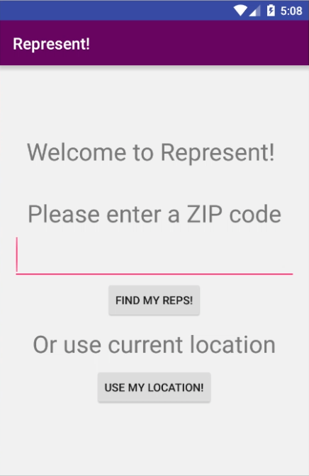
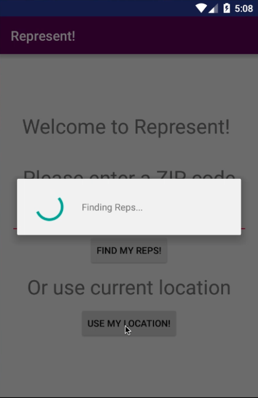
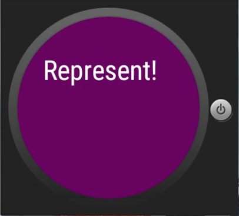
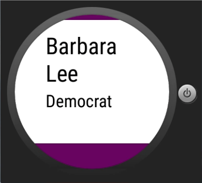
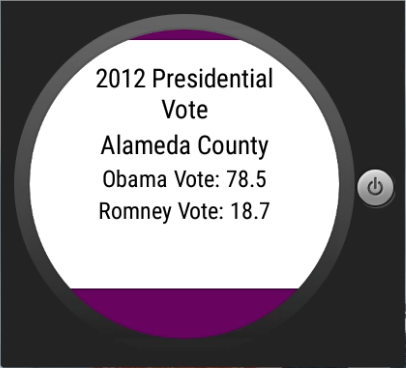

# PROG02 Represent!

This app allows you to enter in a ZIP or use your current location to bring up
a list of representatives for that geographic area. Clicking on the 
representatives will then bring up more detailed information about the
representative which includes which committees their on and the most recent
bills they sponsored. The app also has watch component that updates along with
phone and also displays a brief overviw of each representative (name and party)
along with a vote view that shows the 2012 presidential vote results for the
county associated with the given location. Clicking on a representative on the
watch will also bring up the detailed view on the phone.

## Screenshots

